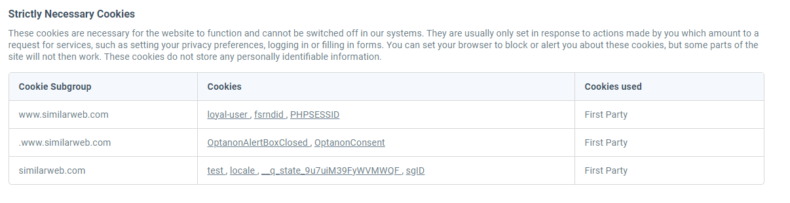

<br></br>
<h2><center>SpeedIO_Project</center></h2>

O projeto está organizado da seguinte maneira:

- **App**: Contém o código principal do aplicativo.
  - **Api**: Módulo para a implementação da API usando FastAPI.
  - **Database**: Módulo responsável pela interação com o MongoDB.
  - **Scraping**: Módulo para realizar scraping de dados de websites.
- **Selenium**: Módulo relacionado ao uso do Selenium para automação de navegação web.
- **Tests**: Diretório para testes automatizados.
- **venv**: Diretório para o ambiente virtual do Python.
- **requirements.txt**: Arquivo com as dependências do projeto.

## Configuração do Ambiente Virtual (venv)
Certifique-se de criar um ambiente virtual antes de iniciar o projeto. Use o seguinte comando no windows:

```bash
venv\Scripts\activate
```

## Instalação das Dependências
Para instalar as dependências do projeto, use o seguinte comando:

```bash
pip install -r requirements.txt
```

## Execução do Projeto
Para executar o projeto, use o seguinte comando vá até a pasta App/Api e use o seguinte comando:

```bash
uvicorn main:app --reload
```

## Documentação da API
A documentação interativa da API pode ser acessada em http://127.0.0.1:8000/docs.

## Desenvolvimento e Soluções
### API com FastAPI

A API foi desenvolvida usando o framework FastAPI. A escolha do framework foi feita por conta da facilidade de uso, conhecimento prévio e da documentação interativa que ele oferece. Além disso, o FastAPI é um framework que oferece um bom desempenho, sendo mais rápido que o Flask e o Django.

### Integração com MongoDB

Para armazenar e recuperar dados, foi utilizado o MongoDB, um banco de dados NoSQL que oferece flexibilidade e escalabilidade. O módulo `Database` foi criado para gerenciar a conexão com o MongoDB e fornecer operações de inserção e consulta.

### Scraping de Dados

O módulo `Scraping` utiliza o Selenium para realizar scraping de dados de websites. O Selenium é uma ferramenta poderosa para automação de navegadores web, e sua integração no projeto permite a coleta eficiente de informações específicas dos sites.

Para chegar no modelo final foram desenvolvidos outros módulos de scraping, como o `Scraping_cookies` e o `Scraping_no_emulator`. O `scraping_no_emulator` foi uma tentativa de realizar o scraping sem utilizar ferramentas de automação de navegador, mas não foi possível obter os dados desejados ao descobrir que o site utilizava alguns cookies de controle para acesso.

Durante essa investigação foi descoberto quais cookies eram necessários para acessar o site:
Então ao acessar o site com os cookies corretos, foi possível obter os dados mas em uma requisição http não é possível executar scripts como o javascript, então não foi possível obter os dados desejados.

O módulo `Scraping_cookies` foi desenvolvido para tentar contornar o problema de bloqueio de scraping por meio do uso de cookies, utilizando um automatizador de navegador para acessar o site e obter os cookies necessários para acessar o site. Mas também não foi possível obter os dados desejados.


O `scraping_cookies` foi desenvolvido para tentar contornar o problema de bloqueio de scraping por meio do uso de cookies, a partir de uma interação primaria usando o selenium foi possível obter os cookies necessários para acessar o site. Mas também não foi possível obter os dados desejados pela interação de scripts.

Endpoints:

Endpoint /salve_info:

Método: POST

Resumo: Scrape And Save Info

Operação ID: scrape_and_save_info_salve_info_post

Parâmetro do corpo da solicitação: 
- **url**: Url do site a ser acessado.
- **clean_data**: Flag para limpeza de quebras de linhas.

Tipo: ScrapingRequest

Necessário: Sim

Respostas:
- **Código 200**: Resposta bem-sucedida (ScrapingResponse)
- **Código 422**: Erro de validação (HTTPValidationError)

Endpoint /get_info:

Método: POST

Resumo: Get Info

Operação ID: get_info_get_info_post

Parâmetro do corpo da solicitação:
- **url**: Url do site a ser recuperado.

Tipo: GetInfoRequest

Necessário: Sim

Respostas:
- **Código 200**: Resposta bem-sucedida (GetInfoResponse)
- **Código 422**: Erro de validação (HTTPValidationError)


